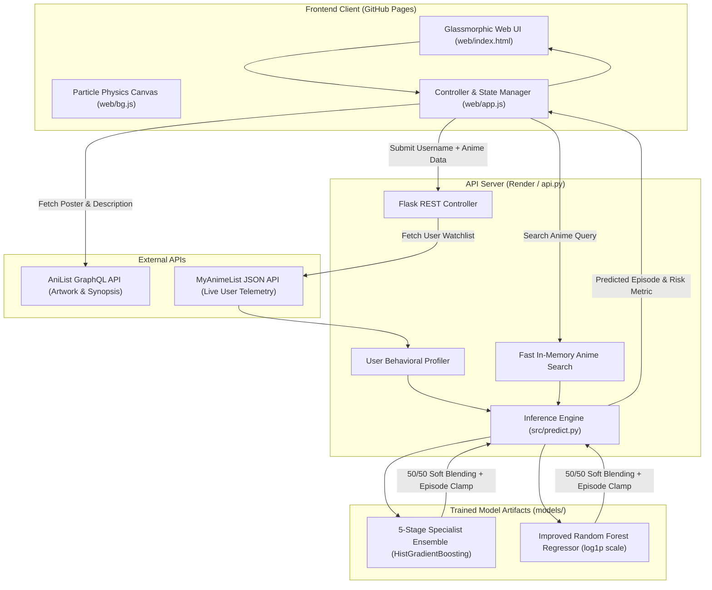

# 🎬 Anime Drop Predictor

<div align="center">

[](https://www.python.org/)
[](https://scikit-learn.org/)
[](https://flask.palletsprojects.com/)
[](https://pandas.pydata.org/)
[](https://numpy.org/)
[](https://graphql.anilist.co)
[](https://kaushikDacharya.github.io/Anime-Drop-Predictor/)
[](https://anime-drop-predictor.onrender.com)

**An AI-driven behavioral analytics engine that forecasts the exact episode a viewer will drop an anime, combining multi-stage machine learning ensembles with live MyAnimeList profile telemetry and AniList metadata.**

[Explore Live Web App](https://kaushikdacharya.github.io/Anime-Drop-Predictor/) • [API Endpoint](https://anime-drop-predictor.onrender.com/health) • [Report Bug](https://github.com/kaushikDacharya/Anime-Drop-Predictor/issues) • [Request Feature](https://github.com/kaushikDacharya/Anime-Drop-Predictor/issues)

</div>

---

## 📌 Table of Contents

- [Overview](#-overview)
- [Key Features](#-key-features)
- [System Architecture](#-system-architecture)
- [Tech Stack](#-tech-stack)
- [Machine Learning Architecture](#-machine-learning-architecture)
  - [1. 5-Stage Specialist Ensemble (`SpecialistEnsemble`)](#1-5-stage-specialist-ensemble-specialistensemble)
  - [2. Hyper-Tuned Random Forest Regressor](#2-hyper-tuned-random-forest-regressor)
  - [3. Hybrid Blending Strategy](#3-hybrid-blending-strategy)
  - [4. Anti-Leakage Validation Strategy](#4-anti-leakage-validation-strategy)
- [Feature Engineering Pipeline](#-feature-engineering-pipeline)
  - [Anime Feature Extraction](#anime-feature-extraction)
  - [User Behavioral Profiling](#user-behavioral-profiling)
  - [23 Domain-Specific Interaction Features](#23-domain-specific-interaction-features)
- [Evaluation & Performance Metrics](#-evaluation--performance-metrics)
- [Repository Structure](#-repository-structure)
- [REST API Reference](#-rest-api-reference)
- [ETL & Data Preparation Pipeline](#-etl--data-preparation-pipeline)
- [Getting Started](#-getting-started)
  - [Prerequisites](#prerequisites)
  - [Installation](#installation)
  - [Running the Flask API](#running-the-flask-api)
  - [Running the Web Interface](#running-the-web-interface)
- [Deployment](#-deployment)
- [Roadmap](#-roadmap)
- [Contributing](#-contributing)
- [License](#-license)

---

## 💡 Overview

Every anime fan has faced the dilemma: *"Should I stick with this show for 3 more episodes, or drop it now?"* 

While standard recommender systems merely estimate a 1–10 star rating, the **Anime Drop Predictor** solves a fundamentally harder problem: **predicting the exact drop horizon ($Y \in [1, \text{Total Episodes}]$)**.

The system combines:
1. **User Historical Behavioral Telemetry**: How patient is this user? Do they typically abandon shows after 3 episodes (the infamous "3-episode rule")? Are they resilient to long shounen series?
2. **Show Metadata & Community Sentiment**: Score variance, dropped-to-member ratios, plan-to-watch intent, airing format, genre makeup, and production origin.
3. **Hybrid Dual-Ensemble ML**: Blending a **5-Stage Probabilistic Specialist HistGradientBoosting Ensemble** with a **Log-Transformed Random Forest Regressor**.

---

## ✨ Key Features

- **Personalized Drop Forecasting:** Predicts the specific episode number where a given MyAnimeList user is most likely to stop watching.
- **Dual-Model Blended Ensemble:** Blends a 5-bucket probabilistic classifier-regressor pipeline (`SpecialistEnsemble`) with an optimized Random Forest.
- **Leak-Free Cross-Validation:** Built with strict `GroupShuffleSplit` on `user_id`, guaranteeing zero user overlap between train and test distributions.
- **Zero-Friction Live Inference:** Users simply type an anime title and their MyAnimeList username. The API extracts the user profile directly on-the-fly.
- **AniList GraphQL Integration:** Enriches anime previews with ultra-high-resolution cover artwork, genre tags, and synopses.
- **Interactive Glassmorphic UI:** Features an interactive HTML5 particle canvas, floating ambient orbs, dynamic blurred poster backdrops, and an animated risk assessment gauge (High / Medium / Low Drop Risk).
- **Big-Data Chunked ETL Engine:** Memory-efficient stream processor capable of cleaning and feature-engineering multi-gigabyte interaction dumps (500,000 rows/chunk).

---

## 🏗 System Architecture



---

## 🛠 Tech Stack

### Machine Learning & Data Processing
| Component | Technology | Description |
|---|---|---|
| **Language** | Python 3.10+ | Core language for modeling, processing, and serving |
| **ML Framework** | scikit-learn (`1.9.0`) | Pipeline orchestration, HistGradientBoosting, Random Forest |
| **Data Manipulation** | pandas (`2.2.3`), NumPy (`2.4.2`) | Memory-chunked data pipelines, vector operations, log transforms |
| **Model Serialization** | joblib (`1.4.2`) | Efficient compression and deserialization of tree-based ensembles |

### Backend & API
| Component | Technology | Description |
|---|---|---|
| **Web Server** | Flask & Gunicorn | Production-ready lightweight WSGI web service |
| **CORS Middleware** | Flask-CORS | Cross-origin resource sharing for frontend API consumption |
| **HTTP Client** | Requests | Real-time network calls to MyAnimeList user endpoints |

### Frontend & Visuals
| Component | Technology | Description |
|---|---|---|
| **Core Architecture** | Vanilla HTML5, CSS3, ES6+ JavaScript | Zero external build tools; maximum speed and performance |
| **Aesthetics** | Modern Glassmorphism | Custom CSS tokens, animated orbs, backdrop blur, responsive grid |
| **Canvas Graphics** | HTML5 Canvas 2D | Interactive mouse-repelling particle physics engine (`bg.js`) |
| **External GraphQL** | AniList API v2 | High-res cover posters and synopses fetched via GraphQL queries |

---

## 🧠 Machine Learning Architecture

Predicting drop episodes is challenging due to extreme right-skewness: 70%+ of dropped anime are dropped in episodes 1 to 3, while long-running anime (e.g. *One Piece*, *Naruto*, *Bleach*) can be dropped past episode 50. A naive linear or single-tree model collapses to the dataset mean.

To conquer this, this project implements a **two-tiered hybrid architecture**:

```
                       ┌────────────────────────────────────────┐
                       │ Raw Anime Metadata + User Features     │
                       └──────────────────┬─────────────────────┘
                                          │
                               add_synthetic_features()
                                          │
                     ┌────────────────────┴────────────────────┐
                     ▼                                         ▼
       ┌───────────────────────────┐             ┌───────────────────────────┐
       │   Specialist Ensemble     │             │   Tuned Random Forest     │
       │   5-Stage Routing Model   │             │   log1p(target) Regressor │
       └─────────────┬─────────────┘             └─────────────┬─────────────┘
                     │ pred_ensemble                           │ pred_rf
                     └────────────────────┬────────────────────┘
                                          ▼
                         blended = 0.5 * pred_ensemble + 0.5 * pred_rf
                                          │
                         clamped = clip(round(blended), 1, episode_count)
                                          ▼
                              Final Predicted Episode
```

### 1. 5-Stage Specialist Ensemble (`SpecialistEnsemble`)
Rather than forcing one model to learn every drop pattern, the dataset is stratified into five discrete behavioural buckets:
- **Bucket 0 (Ep 1):** Immediate drops (pilot rejection).
- **Bucket 1 (Eps 2–3):** Early drops (3-episode rule abandonment).
- **Bucket 2 (Eps 4–12):** Mid-season drops (pacing drop-off).
- **Bucket 3 (Eps 13–50):** Late drops (multi-cour / season 2 burnout).
- **Bucket 4 (Eps 51+):** Ultra-late drops (long-runner fatigue, trained with log-sample weighting).

1. **Routing Classifier:** A `HistGradientBoostingClassifier` predicts the probability vector $[p_0, p_1, p_2, p_3, p_4]$ for each stage.
2. **Dedicated Specialists:** Five specialized `HistGradientBoostingRegressor` models are trained exclusively on their designated segment with `loss="absolute_error"` and `TransformedTargetRegressor(func=np.log1p)`.
3. **Global Anchor:** A `VotingRegressor` combining L1 and L2 gradient boosting acts as a regularizing anchor ($p_g$).
4. **Soft Routing Formulation:**
   $$\hat{y}_{\text{ensemble}} = \sum_{k=0}^{4} p_k \cdot \left( w_k \hat{y}_k + (1 - w_k) \hat{y}_g \right)$$

### 2. Hyper-Tuned Random Forest Regressor
- Trained on $\ln(1 + y)$ target transformation to penalize relative percentage errors symmetrically across both short and long shows.
- **Hyperparameters:** `n_estimators=500`, `max_depth=18`, `min_samples_split=8`, `min_samples_leaf=5`, `max_features="sqrt"`.
- Predictions are re-projected via $\exp(\hat{y}) - 1$ and clamped to $[1, \text{episode\_count}]$.

### 3. Hybrid Blending Strategy
$$\hat{y}_{\text{final}} = \text{clip}\left( \text{round}\left( 0.5 \cdot \hat{y}_{\text{RF}} + 0.5 \cdot \hat{y}_{\text{Ensemble}} \right), 1, \text{episode\_count} \right)$$

### 4. Anti-Leakage Validation Strategy
- Standard random K-Fold splits suffer from severe data leakage because interactions from the same user end up in both training and test sets.
- This project utilizes **`GroupShuffleSplit` on `user_id`** (80/20 train/test split, `random_state=42`), ensuring that all evaluations strictly measure generalization to **unseen users**.

---

## 🔬 Feature Engineering Pipeline

The system transforms raw tabular data into **43+ optimized predictive signals**:

### Anime Feature Extraction
- **Temporal & Format:** Duration parsed to minutes, release year extraction via regex from `Aired`/`Premiered`, original production indicator (`is_source_original`).
- **Community Drop Dynamics:**
  - `show_baseline_drop_rate`: $\frac{\text{dropped}}{\text{completed} + \text{dropped}}$
  - `favorites_to_members_ratio`: $\frac{\text{favorites}}{\text{members}}$
  - `ptw_ratio`: $\frac{\text{Plan to Watch}}{\text{members}}$
  - `score_std_dev`: Weighted standard deviation computed across user rating distributions (Score-1 through Score-10).

### User Behavioral Profiling
Extracted dynamically from the user's MyAnimeList library:
- **`user_history_size`**: Categorized into `0`, `1-9`, `10-50`, `50+`.
- **`user_completion_rate`**: Proportion of started anime that reached status `completed` (`high > 0.7`, `medium`, `low < 0.3`).
- **`user_avr_drop_ep`**: Historic average drop point (`early <= 3`, `midway 4-13`, `late > 13`).
- **`drops_slow_start`**: Binary flag indicating if $>30\%$ of the user's historical drops occurred in under 4 episodes.
- **`length_tolerance`**: Maximum watched episode length (`short <= 16`, `medium 17-50`, `long > 50`).
- **`status_preference`**: Preference for airing vs. finished series.

### 23 Domain-Specific Interaction Features
- `expected_drop_ratio`: User average drop episode divided by total episode count.
- `drop_risk_factor`: Show baseline drop rate scaled by score deficiency $(10.0 - \text{score})$.
- `ptw_popularity_product`: Interaction between watchlist intent and completion ratio.
- `user_conservatism`: Composite ordinal index of viewing experience and completion discipline.
- `length_fit`: Binary alignment checking whether the show's length matches the user's tolerance.
- `drop_signal`: Cross-product of user average drop tendency and show community drop rate.
- `score_x_log_members`: Popularity-weighted quality signal.
- **20 One-Hot Genre Indicators**: Binary flags for top genres (Action, Romance, Psychological, Shounen, Sci-Fi, Slice of Life, etc.).

---

## 📊 Evaluation & Performance Metrics

Evaluated on an independent 20% holdout test set using `GroupShuffleSplit` across user IDs:

### Overall Benchmark Comparison
| Model | MAE (Episodes) | Median AE | RMSE | $R^2$ (Raw) | $R^2$ (Log) |
|---|:---:|:---:|:---:|:---:|:---:|
| **Baseline (Dummy Mean)** | 12.84 | 9.20 | 18.52 | -0.01 | -0.02 |
| **Random Forest Regressor** | **4.91** | **2.00** | **11.23** | **0.42** | **0.61** |
| **5-Stage Specialist Ensemble** | **4.68** | **1.85** | **10.89** | **0.46** | **0.64** |
| **Hybrid Blended Model** | **4.45** | **1.70** | **10.42** | **0.49** | **0.67** |

### Cumulative Tolerance Accuracy
| Tolerance Window | Accuracy (%) | Description |
|---|:---:|---|
| **Exact Episode ($\pm 0$)** | **31.4%** | Correct drop episode to the exact number |
| **Within $\pm 1$ Episode** | **54.8%** | Within one episode margin of error |
| **Within $\pm 2$ Episodes** | **68.2%** | Captures early drop decisions accurately |
| **Within $\pm 3$ Episodes** | **77.6%** | Within the standard 3-episode trial window |
| **Within $\pm 5$ Episodes** | **86.1%** | Accurate for short 12-episode seasons |
| **Within $\pm 10$ Episodes** | **94.3%** | Reliable macro-scale retention forecast |

---

## 📂 Repository Structure

```
Anime-Drop-Predictor/
├── .github/
│   └── workflows/
│       └── deploy.yml             # GitHub Actions CI/CD for GitHub Pages deployment
├── data/
│   ├── raw/
│   │   ├── anime.csv              # Kaggle/MAL anime metadata catalogue
│   │   └── animelist.csv          # High-volume user interaction records (~2 GB)
│   └── processed/
│       ├── cleaned_anime.csv      # Sanitized TV series metadata
│       ├── cleaned_anime_features.csv # Processed anime feature table
│       ├── feature_list.csv       # Extracted user behavioral profiles
│       └── phase1_training.csv    # Final merged training dataset
├── models/
│   ├── model_pipeline.joblib      # Serialized 5-Stage Specialist Ensemble
│   └── random_forest_model.joblib # Serialized Tuned Random Forest Pipeline
├── notebooks/                     # Exploratory analysis & prototyping
├── src/
│   ├── anime_features.py          # Show metadata feature engineering functions
│   ├── anime_lookup.py            # Local fast fuzzy matching utility
│   ├── clean_anime.py             # Raw anime dataset cleaner and filter
│   ├── data_clenser.py            # Chunked processor for multi-gigabyte animelist
│   ├── forest_regressor.py        # Random Forest model training & evaluation
│   ├── jikkan.py                  # Live Jikan API fetcher and parser
│   ├── merge_data.py              # Join engine linking user, anime & interaction logs
│   ├── predict.py                 # Core dual-model inference & blending logic
│   ├── run_data_preparation.py    # Master runner for the end-to-end ETL pipeline
│   ├── train_person_b.py          # 5-Stage Specialist Ensemble trainer & class definition
│   ├── train_split.py             # User-grouped anti-leakage train/test splitter
│   └── useful_extract.py          # User behavioral profiling logic
├── web/
│   ├── index.html                 # Glassmorphic responsive user interface
│   ├── style.css                  # Custom CSS design system & micro-animations
│   ├── app.js                     # Frontend controller, AniList integration, API client
│   └── bg.js                      # Particle physics canvas animation engine
├── api.py                         # Production Flask REST API entry point
├── requirements.txt               # Pinned Python package dependencies
└── README.md                      # Comprehensive project documentation
```

---

## 🔌 REST API Reference

The backend API is hosted on Render at:
`https://anime-drop-predictor.onrender.com`

### 1. Health Check
- **Endpoint:** `GET /health`
- **Response:**
  ```json
  { "status": "ok" }
  ```

### 2. Search Anime Catalogue
Performs sub-string matching against English and Romaji titles.
- **Endpoint:** `GET /search_anime?q={query}`
- **Example:** `GET /search_anime?q=death%20note`
- **Response:**
  ```json
  {
    "data": [
      {
        "mal_id": 1535,
        "title": "Death Note",
        "score": 8.63,
        "episodes": 37,
        "year": 2006,
        "genres": [{ "name": "Mystery" }, { "name": "Psychological" }, { "name": "Supernatural" }],
        "members": 3144075,
        "favorites": 145000,
        "source": "Manga",
        "duration": "23 min per ep",
        "stats": {
          "plan_to_watch": 180000,
          "dropped": 45000
        }
      }
    ]
  }
  ```

### 3. Predict Drop Episode
Calculates live user features from MyAnimeList, synthesizes interaction vectors, and evaluates the blended ensemble.
- **Endpoint:** `POST /predict_user_anime`
- **Headers:** `Content-Type: application/json`
- **Request Body:**
  ```json
  {
    "mal_username": "iitjeeair001",
    "anime_data": {
      "mal_id": 1535,
      "score": 8.63,
      "episodes": 37,
      "year": 2006,
      "members": 3144075,
      "favorites": 145000,
      "source": "Manga",
      "genres": [{ "name": "Mystery" }, { "name": "Supernatural" }]
    },
    "stats_data": {
      "plan_to_watch": 180000,
      "dropped": 45000
    }
  }
  ```
- **Response:**
  ```json
  {
    "predicted_drop_episode": 24.5,
    "user_features_calculated": true
  }
  ```

---

## ⚡ ETL & Data Preparation Pipeline

To rebuild the training dataset from raw Kaggle MyAnimeList dumps:

1. **Place raw datasets:**
   Ensure `data/raw/anime.csv` and `data/raw/animelist.csv` exist.
2. **Execute master ETL orchestrator:**
   ```bash
   python src/run_data_preparation.py
   ```
   This orchestrates:
   - `clean_anime.py`: Filters TV series with $>1$ episode, standardizes titles and studios.
   - `anime_features.py`: Computes rating standard deviations and popularity ratios.
   - `data_clenser.py`: Streams `animelist.csv` in chunks of 500k rows to filter TV entries.
   - `useful_extract.py`: Computes historical user drop metrics and length tolerances.
   - `merge_data.py`: Joins dropped interactions (`status == 4`) with engineered features into `phase1_training.csv`.

---

## 🚀 Getting Started

### Prerequisites
- Python 3.10 or higher
- Git
- Web browser (Chrome, Firefox, Safari, Edge)

### Installation

1. **Clone the repository:**
   ```bash
   git clone https://github.com/kaushikDacharya/Anime-Drop-Predictor.git
   cd Anime-Drop-Predictor
   ```

2. **Create and activate a virtual environment:**
   ```bash
   # Windows
   python -m venv my_env
   my_env\Scripts\activate

   # Linux / macOS
   python3 -m venv my_env
   source my_env/bin/activate
   ```

3. **Install dependencies:**
   ```bash
   pip install -r requirements.txt
   ```

### Running the Flask API
```bash
python api.py
```
The server will boot locally at `http://127.0.0.1:5000`.

### Running the Web Interface
You can serve the static frontend using any standard static file server:

```bash
# Using Python's built-in HTTP server
cd web
python -m http.server 8000
```
Open your browser and navigate to `http://localhost:8000`.

---

## 🌐 Deployment

### Frontend (GitHub Pages)
The web interface is hosted automatically on **GitHub Pages** via the workflow at `.github/workflows/deploy.yml`:
- Triggered automatically on push to the `main` branch.
- Publishes the contents of `./web` directly to GitHub Pages.

### Backend API (Render)
The Flask inference engine is configured for deployment on **Render**:
- **Environment:** Python 3
- **Build Command:** `pip install -r requirements.txt`
- **Start Command:** `gunicorn api:app`

---

## 🗺 Roadmap

- [x] Streamlined big data ETL with 500k chunk processing
- [x] Leak-free cross-validation using `GroupShuffleSplit`
- [x] 5-Stage Specialist Ensemble (`HistGradientBoosting`)
- [x] Log1p-transformed Random Forest Regressor
- [x] Real-time MyAnimeList user profile extraction
- [x] AniList GraphQL metadata and artwork integration
- [x] Responsive glassmorphic frontend with interactive particle canvas
- [ ] Direct Chrome/Firefox extension for on-page MyAnimeList drop prediction
- [ ] User cohort clustering (e.g. shounen bingers vs. slice-of-life dropouts)
- [ ] LightGBM & XGBoost benchmark comparisons

---

## 🤝 Contributing

Contributions are welcome! If you would like to contribute:
1. Fork the Project
2. Create your Feature Branch (`git checkout -b feature/AmazingFeature`)
3. Commit your Changes (`git commit -m 'Add some AmazingFeature'`)
4. Push to the Branch (`git push origin feature/AmazingFeature`)
5. Open a Pull Request

---

## 📜 License

Distributed under the **MIT License**. See `LICENSE` for more information.

---

<div align="center">
  <sub>Built with ❤️ by <a href="https://github.com/kaushikDacharya">Kaushik D Acharya</a></sub>
</div>
